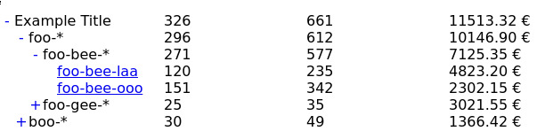

# Foldable Table

Given a dataset:

```
const data = [
  { id: "foo-bee-laa"     , url: "http://example.com/foo/bee/laa"     , data: [120 , 235 , 482320 , ] } ,
  { id: "foo-bee-ooo"     , url: "http://example.com/foo/bee/ooo"     , data: [151 , 342 , 230215 , ] } ,
  { id: "foo-gee-sii"     , url: "http://example.com/foo/gee/sii"     , data: [25  , 35  , 302155 , ] } ,
  { id: "boo-zee-laa"     , url: "http://example.com/boo/zee/laa"     , data: [20  , 35  , 12600  , ] } ,
  { id: "boo-lee"         , url: "http://example.com/boo/lee"         , data: [8   , 12  , 94242  , ] } ,
  { id: "boo-lee-laa"     , url: "http://example.com/boo/lee/laa"     , data: [1   , 1   , 14900  , ] } ,
  { id: "boo-lee-laa-kii" , url: "http://example.com/boo/lee/laa/kii" , data: [1   , 1   , 14900  , ] } ,
];
```

It creates a foldable table as this:


